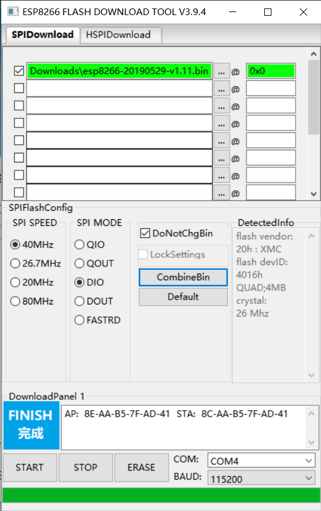
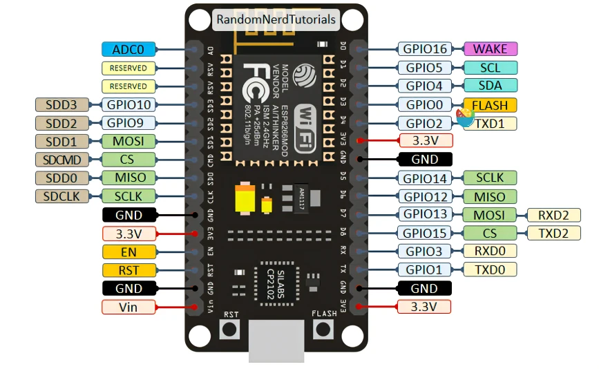

# esp8266 **NodeMCU**

简单入门记录一下

## 编程环境搭建

### ardunio IDE

123上链接：

[ardunio ide搭建esp8266编程环境](http://www.taichi-maker.com/homepage/esp8266-nodemcu-iot/iot-c/nodemcu-arduino-ide/)

### micropython

[烧录工具](https://www.espressif.com/en/support/download/other-tools)

[micropython固件下载](https://micropython.org/download/esp8266/)

用烧录工具将固件烧入esp8266。

方法：按住RST键再插入usb，此时START，放手等待同步烧录。



[编程工具下载](http://docs.dfrobot.com.cn/upycraft/)

Tools里选择board与serial。创建main.py文件并点击右侧运行。

测试代码：板载灯呼吸一次

```
from machine import Pin,PWM
import math,time
pwm = PWM(Pin(2, Pin.OUT), freq=500)

def pulse(l, t):
    for i in range(20):
        l.duty(int(math.sin(i/10 * 3.14) * 500 + 500))
        time.sleep_ms(t)
    
pulse(pwm, 200)  # 让板载灯明暗变化一次
pwm.deinit()
```


### GPIO && PWM



引脚与micropython对应：

| **Label** | **GPIO**   | **Input** | **Output**   | **Notes**                                                  |
| --------------- | ---------------- | --------------- | ------------------ | ---------------------------------------------------------------- |
| **D0**    | **GPIO16** | 无中断          | 无 Pwm 或 I2c 支持 | HIGH at boot used to wake up from deep sleep                     |
| **D1**    | **GPIO5**  | OK              | OK                 | 常用作SCL（I2C）                                                 |
| **D2**    | **GPIO4**  | OK              | OK                 | 常用作SDA（I2C）                                                 |
| **D3**    | **GPIO0**  | 上拉            | OK                 | connected to FLASH button, boot fails if pulled LOW              |
| **D4**    | **GPIO2**  | 上拉            | OK                 | HIGH at boot connected to on-board LED, boot fails if pulled LOW |
| **D5**    | **GPIO14** | OK              | OK                 | SPI (SCLK)                                                       |
| **D6**    | **GPIO12** | OK              | OK                 | SPI (MISO)                                                       |
| **D7**    | **GPIO13** | OK              | OK                 | SPI (MOSI)                                                       |
| **D8**    | **GPIO15** | 下拉            | OK                 | SPI (CS) Boot fails if pulled HIGH                               |
| **RX**    | **GPIO3**  | OK              | RX                 | HIGH at boot                                                     |
| **TX**    | **GPIO1**  | TX              | OK                 | HIGH at boot debug output at boot, boot fails if pulled LOW      |
| **A0**    | **ADC0**   | 模拟引脚        | X                  |                                                                  |


```python
from machine import Pin
led = Pin(2, Pin.OUT)    # 2----GPIO2
led.value(0)             # LOW
led.value(1)             # HIGH
```

pwm有两个参数：

duty-->占空比（一个脉冲周期低电平占比，ESP8266最大duty1023）

freq--->频率（每秒输出多少个周期脉冲）

```python
from machine import Pin,PWM
led = PWM(Pin(2, Pin.OUT), freq=500)
led.duty(500)   # 中间电压，半亮
led.duty(1000)  # 接近低电压，微微亮
led.duty(10)    # 接近高电压，几乎全亮

from machine import Pin,PWM
led = PWM(Pin(2, Pin.OUT), freq=500)
led.duty(500)   # 半亮
led.freq(500)  # 看不出什么
led.freq(50)   # 有点想抖动的感觉
led.freq(2)   # 每秒闪两下。。。。 有点手机消息提示闪灯的感觉了 

```
